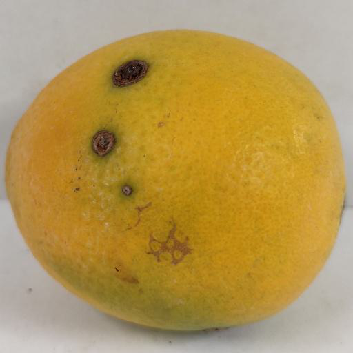
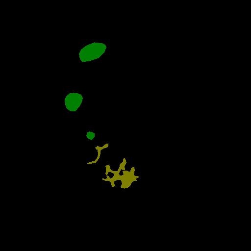
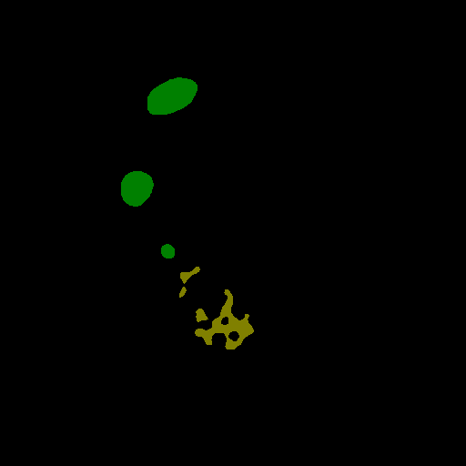
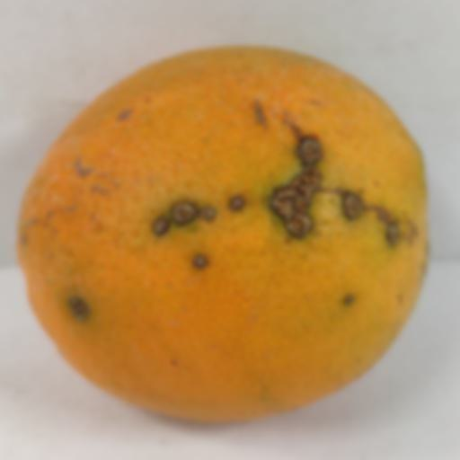
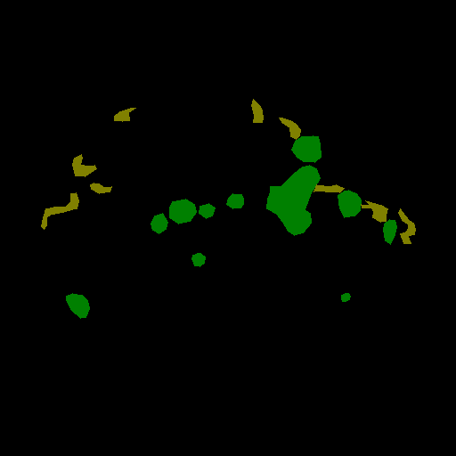
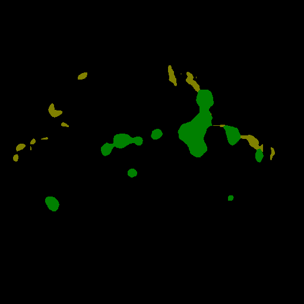
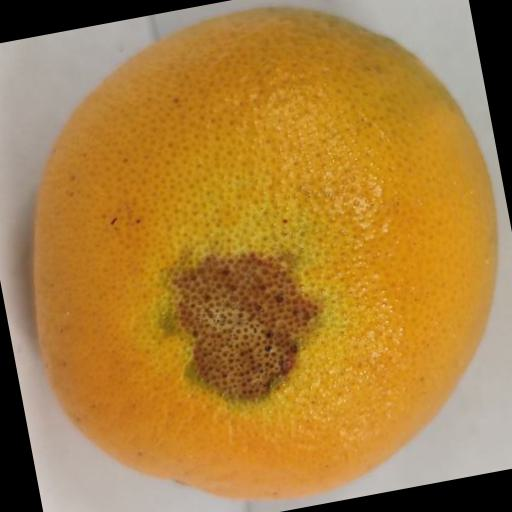
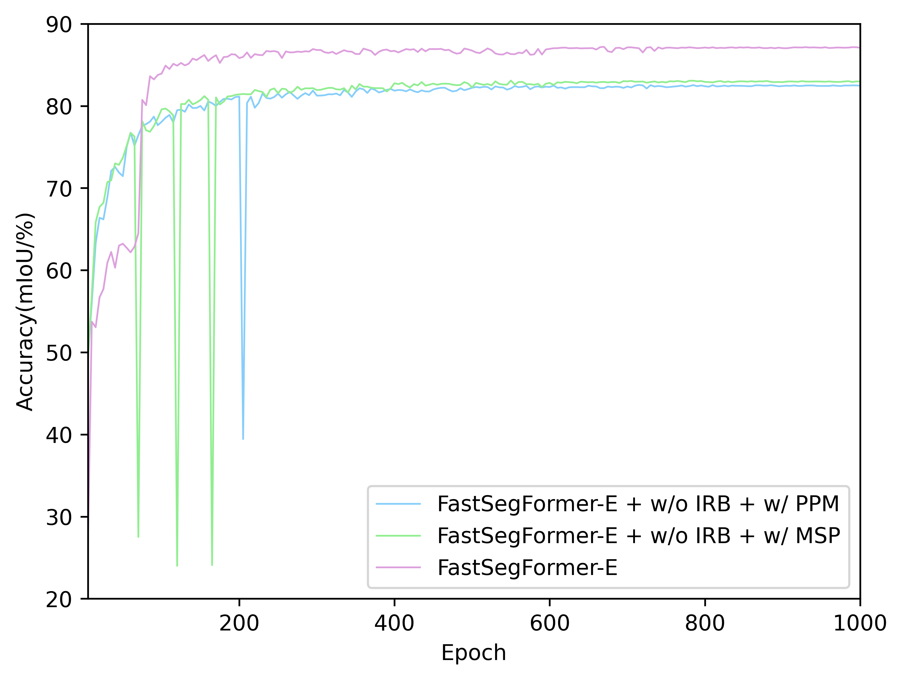
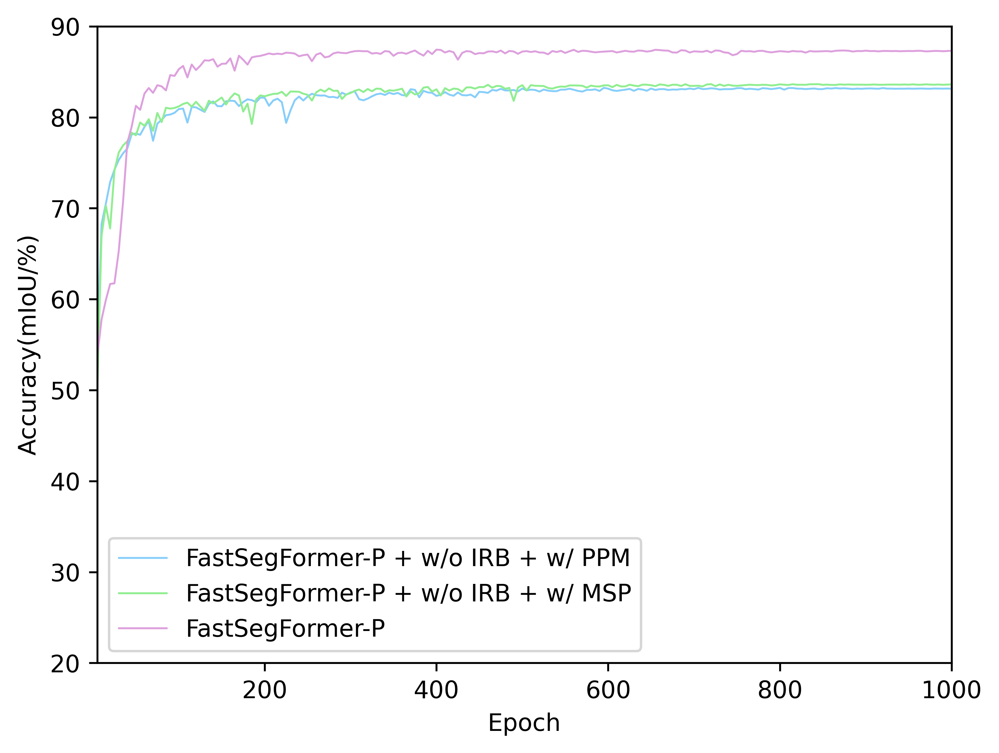

## FastSegFormer: A knowledge distillation-based method for real-time semantic segmentation of surface defects in navel oranges

[中文](README_CH.md)

This is the official repository for our work: FastSegFormer([PDF]())

### Highlights

---

* Performance of different models on navel orange dataset (test set) against their detection speed on RTX3060:

<p align="center">

</p>

* Performance of different models on navel orange dataset (test set) against their parameters:

<p align="center">

</p>


### Updates

---

- [x] The training and testing codes are available here.(April/25/2023)
- [x] Create PyQT interface for navel orange defect segmentation. (May/10/2023)
- [x] Produce 30 frames of navel orange assembly line simulation video. (May/13/2023)
- [x] Add yolov8n-seg and yolov8-seg instance segmentation training, test, and prediction results.[Jump to](yolov8-seg/README.md)(December/10/2023)

### Demos

---

* Some demos of the segmentation performance of our proposed FastSegFormer:Original image(left) and Label image(middle) and
FastSegFormer-P(right). The original image contains enhanced image.

<!-- 3x6 grid of images -->
<div align="center">
  
  
  
  <br>
  
  
  
  <br>
  
  
  
</div>

* A demo of Navel Orange Video Segmentation:Original video(left) and detection video(right).
The actual detection video reaches 45~55 fps by weighted half-precision (FP16) quantization technique
 and multi-thread processing technique.(The actual video detection is the total latency of pre-processing, inference and post-processing of the image).
Navel orange defect picture and video detection UI is available at [FastSegFormer-pyqt](https://github.com/caixiongjiang/FastSegFormer-pyqt).

<p align="center">
  
  </br>
  <span align="center">Navel orange simulation line detection video</span>
</p>

### Overview

---

* An overview of the architecture of our proposed FastSegFormer-P. The architecture of FastSegFormer-E is derived from FastSegFormer-P
replacing the backbone network EfficientFormerV2-S0.


* An overview of the proposed multi-resolution knowledge distillation.(To solve the problem that the size and number of channels of the teacher network and student
network feature maps are different:the teacher network's feature maps are down-sampled by bilinear interpolation, and the student network's feature maps
 are convolved point-by-point to increase the number of channels)


**P&KL loss**:

$$
L_{logits}(\text{S}) = \frac{1}{W_{s}\times H_{s}}(k_1t^2 \sum_{i \in R}\text{KL}(q_i^s, q_i^t) + (1 - k_1)\sum_{i \in R}\text{MSE}(p_i^s, p_i^t))
$$

Where $q_{i}^s$ represents the class probability of the $i$ th pixel output from the simple network S, $q_{i}^t$ represents
the class probability of the $i$ th pixel output from the complex network T, $\text{KL}(\cdot)$ represents Kullback-Leibler
divergence, $p_{i}^s$ represents the $i$ th pixel output from the simple network S, $p_{i}^t$ represents the $i$ th pixel
output from the complex network T, $\text{MSE}(\cdot)$ represents the mean square error calculation, 
$R=\{1,2,..., W_s\times H_s\}$ represents all pixels, and $t$ represents the temperature coefficient. In this experiment, 
$t=2$, $k_1=0.5$.

**NFD loss**:

$$
L_{n}^{NFD} = \sum_{i=1}^n \frac{1}{W_s\times H_s} L_2(\text{Normal}(F_{i}^t), \text{Normal}(F_{i}^s))
$$

Where $n$ represents the number of intermediate feature maps, $W_s$ and $H_s$ represent the height and width of the simple model 
feature map, $L_2(\cdot)$ represents the Euclidean calculation of the feature maps, $F_{i}^t$ represents the $i$ th feature map generated
by the complex network T, $F_{i}^s$ represents the $i$ th feature map generated by the simple network S,
$\text{Normal}$ represents the normalization of the feature maps on $(W, H)$, the $\text{Normal}(\cdot)$ is given as follows:

$$
\bar{F} = \frac{1}{\sigma}(F - u)
$$

where $F$ represents the original feature map, $\bar{F}$ represents the feature transform, and 
$u$ and $\sigma$ represent the mean and standard deviation of the features.

### Models

---

* Pretrained backbone network:

|  Model(ImageNet-1K)  |    Input size    |                                                               ckpt                                                               |
|:--------------------:|:----------------:|:--------------------------------------------------------------------------------------------------------------------------------:|
| EfficientFormerV2-S0 | $224\times 224$  | [download](https://github.com/caixiongjiang/FastSegFormer/releases/download/v1.0.0/EfficientformerV2_s0_ImageNet_1k_224x224.pth) |
| EfficientFormerV2-S1 | $224\times 224$  | [download](https://github.com/caixiongjiang/FastSegFormer/releases/download/v1.0.0/EfficientformerV2_s1_ImageNet_1k_224x224.pth) |
|    PoolFormer-S12    | $224\times 224$  |    [download](https://github.com/caixiongjiang/FastSegFormer/releases/download/v1.0.0/poolformer_s12_ImageNet_1k_224x224.pth)    |
|    PoolFormer-S24    | $224\times 224$  |    [download](https://github.com/caixiongjiang/FastSegFormer/releases/download/v1.0.0/poolformer_s24_ImageNet_1k_224x224.pth)    |
|    PoolFormer-S36    | $224\times 224$  |    [download](https://github.com/caixiongjiang/FastSegFormer/releases/download/v1.0.0/poolformer_s36_ImageNet_1k_224x224.pth)    |
|       PIDNet-S       | $224\times 224$  |       [download](https://github.com/caixiongjiang/FastSegFormer/releases/download/v1.0.0/PIDNet_S_ImageNet_1k_224x224.pth)       |
|       PIDNet-M       | $224\times 224$  |       [download](https://github.com/caixiongjiang/FastSegFormer/releases/download/v1.0.0/PIDNet_M_ImageNet_1k_224x224.pth)       |
|       PIDNet-L       | $224\times 224$  |       [download](https://github.com/caixiongjiang/FastSegFormer/releases/download/v1.0.0/PIDNet_L_ImageNet_1k_224x224.pth)       |

* Teacher network:

|      Model      |   Input size    | mIoU(%) | mPA(%) | Params | GFLOPs |                                                                      ckpt                                                                       |
|:---------------:|:---------------:|:-------:|:------:|:------:|:------:|:-----------------------------------------------------------------------------------------------------------------------------------------------:|
| Swin-T-Att-UNet | $512\times 512$ |  90.53  | 94.65  | 49.21M | 77.80  | [download](https://github.com/caixiongjiang/FastSegFormer/releases/download/v1.0.0/teacher_Swin_T_Att_Unet_Orange_Navel_4.5k_input_512x512.pth) |

* FastSegFormer after fine-tuning and knowledge distillation:

|      Model       |    Input size    | mIoU(%) | mPA(%) | Params | GFLOPs | RTX3060(FPS) | RTX3050Ti(FPS) |                                                               ckpt                                                                |                                                   onnx                                                   |
|:----------------:|:----------------:|:-------:|:------:|:------:|:------:|:------------:|:--------------:|:---------------------------------------------------------------------------------------------------------------------------------:|:--------------------------------------------------------------------------------------------------------:|
| FastSegFormer-E  | $224\times 224$  |  88.78  | 93.33  | 5.01M  |  0.80  |      61      |       54       | [download](https://github.com/caixiongjiang/FastSegFormer/releases/download/v1.0.1/FastSegFormer_E_Orange_Navel_4.5k_224x224.pth) | [download](https://github.com/caixiongjiang/FastSegFormer/releases/download/v1.0.2/FastSegFormer_E.onnx) |
| FastSegFormer-P  | $224\times 224$  |  89.33  | 93.78  | 14.87M |  2.70  |     108      |       93       | [download](https://github.com/caixiongjiang/FastSegFormer/releases/download/v1.0.1/FastSegFormer_P_Orange_Navel_4.5k_224x224.pth) | [download](https://github.com/caixiongjiang/FastSegFormer/releases/download/v1.0.2/FastSegFormer_P.onnx) |


### Ablation study

---

You can see all results and process of our experiment in `logs` dir, which include ablation study and comparison 
with other lightweight models.

* The Acc.(mIoU) of FastSegFormer models with different network structure(PPM, MSP and Image reconstruction branch) on validation set:

<p align="left">


</p>

* Knowledge distillation(KD) and fine-tuning(†):

|               Model                | mIoU(%) | mPA(%) | mPrecision(%) | Params | GFLOPs |
|:----------------------------------:|:-------:|:------:|:-------------:|:------:|:------:|
|          FastSegFormer-E           |  86.51  | 91.63  |     93.50     |  5.01  |  0.80  |
|  FastSegFormer-E w/ $\text{KD}_1$  |  87.24  | 92.20  |     93.82     |  5.01  |  0.80  |
|  FastSegFormer-E w/ $\text{KD}_2$  |  87.38  | 92.35  |     93.83     |  5.01  |  0.80  |
|          FastSegFormer-E†          |  88.49  | 93.16  |     94.32     |  5.01  |  0.80  |
| FastSegFormer-E w/ $\text{KD}_1$ † |  88.68  | 92.97  |     94.75     |  5.01  |  0.80  |
| FastSegFormer-E w/ $\text{KD}_2$ † |  88.78  | 93.33  |     94.48     |  5.01  |  0.80  |
|          FastSegFormer-P           |  84.15  | 89.44  |     92.84     | 14.87  |  2.70  |
|  FastSegFormer-P w/ $\text{KD}_1$  |  84.77  | 90.12  |     92.91     | 14.87  |  2.70  |
|  FastSegFormer-P w/ $\text{KD}_2$  |  85.43  | 90.64  |     93.20     | 14.87  |  2.70  |
|          FastSegFormer-P†          |  88.57  | 93.15  |     94.42     | 14.87  |  2.70  |
| FastSegFormer-P w/ $\text{KD}_1$ † |  88.94  | 93.25  |     94.77     | 14.87  |  2.70  |
| FastSegFormer-P w/ $\text{KD}_2$ † |  89.33  | 93.78  |     94.68     | 14.87  |  2.70  |

### Environment

---

This implementation is based on [unet-pytorch](https://github.com/bubbliiiing/unet-pytorch). The detection speed(FPS)
is tested on single RTX3060 and on single RTX3050Ti.

* Hardware Configuration: A graphics card with 12G graphics memory is a must, as our knowledge distillation
method will take up a lot of video memory during training.(When the batch size of knowledge distillation is 6,
 the graphics memory occupies 11.8G) Of course you can also skip the distillation method, which will take up a
very low amount of graphics memory.
* Basic environment configuration: Our code currently only supports single card training. Our training environment
:Python 3.9, Pytorch 1.12.1, CUDA 11.6.

### Usage

#### Prepare the dataset

We only provide 1448 navel orange defect dataset in VOC format, if you want to extend the dataset, you can use
[Imgaug for segmentation maps and masks](https://imgaug.readthedocs.io/en/latest/source/examples_segmentation_maps.html) for data enhancement.

* Download the [Orange_Navel_1.5k](https://github.com/caixiongjiang/FastSegFormer/releases/download/v1.0.0/Orange_Navel_1.5k.zip) dataset and unzip them in `data/Orange_Navel_1.5k` dir.
* The dataset we provide has been randomly partitioned according to the training validation test 6:2:2. You
can re-randomize or re-randomize after changing the ratio using `voc_annotation.py`.

#### Train

* Download the source code zip or clone the project:
```shell
$ git clone https://github.com/caixiongjiang/FastSegFormer
```
* Go to the root directory of project and download the required packages:
```shell
$ conda activate 'your anaconda environment'
$ pip install -r requirements.txt
```

* Download the ImageNet pretrained models and put them into `model_data` dir.

Thanks to three repositories [EfficientFormer](https://github.com/snap-research/EfficientFormer), 
[poolformer](https://github.com/sail-sg/poolformer) and [PIDNet](https://github.com/XuJiacong/PIDNet), We provide the pretraining weights of EfficientFormerV2, PoolFormer 
and PIDNet on ImageNet-1K.

* Modify the parameters of `train.py`. For example, train FastSegFormer-P(fin-tuning):
```python
backbone    = "poolformer_s12"
pretrained  = False
model_path  = "model_data/poolformer_s12.pth"
input_shape = [224, 224]
```
* Train the FastSegFormer-P model on Orange_Navel_1.5k with batch size of 32.
```shell
python train.py
```

#### Knowledge distillation(KD) train

You can train with KD or KD + fine-tuning.

* For example, train with KD + fine-tuning, download the ImageNet pretrained model's checkpoint and
 download the teacher network's checkpoint(Swin-T-Att-UNet). Then put them into `model_data` dir.

* Modify the parameters of `train_distillation.py`. For example, train FastSegFormer-P(KD + fine-tuning):
```python
t_backbone = "swin_T_224"
s_backbone = "poolformer_s12"
pretrained = False
t_model_path = "model_data/teacher_Swin_T_Att_Unet_input_512.pth"
s_model_path = "model_data/poolformer_s12.pth" # if s_model_path = "": from scratch else fine-tuning

Init_Epoch = 0
Freeze_Epoch = 50
Freeze_batch_size = 6
UnFreeze_Epoch = 1000
Unfreeze_batch_size = 6
Freeze_Train = True

Init_lr = 1e-5
Min_lr = Init_lr * 0.01
```

* Train the FastSegFormer-P model using fine-tuning and KD on `Orange_Navel_1.5k` with 
batch size of 6.
```shell
python train_distillation.py
```


#### Evaluation of segmentation
* For example, download the fine-tuning models FastSegFormer-P for Orange_Navel_1.5k and put them into 
`logs/FastSegFormer-P` dir.
* modify the parameters of `unet.py`. For example, evaluate FastSegFormer-P(fin-tuning):
```python
_defaults = {
        "model_path"    : 'logs/FastSegFormer-P.pth',
        "num_classes"   : 3 + 1,
        "backbone"      : "poolformer_s12",
        "input_shape"   : [224, 224],
        "mix_type"      : 1,
        "cuda"          : True,  # if backbone = efficientFormerV2, cuda should be False
    }

def generate(self, onnx=False):
    self.net = FastSegFormer(num_classes=self.num_classes, pretrained=False, backbone=self.backbone, Pyramid="multiscale", cnn_branch=True)
```
* Evaluate the test set on Navel_Orange_1.5k and the result will be in the `miou_out` dir.
```shell
python get_miou.py
```

#### predict
Same as the evaluation session, firstly modify the parameters of `unet.py`, and then run `predict.py`:
```shell
python predict.py
# Generate tips and input the image dir 
Input image filename:'your image dir'
```

#### Evaluation of deployment
* Detection speed(FPS):
```shell
python speeding.py
```

* Params and GFLOPs:
```shell
python model_flop_params.py
```

### Citation

---

if you this implementation is useful for your work, please cite our paper:
```bib

```

### Acknowledgement

---

* This implementation is based on [unet-pytorch](https://github.com/bubbliiiing/unet-pytorch).
* FPS measurement code is borrowed from [FANet](https://github.com/feinanshan/FANet).
* The backbone network checkpoints is download from [EfficientFormer](https://github.com/snap-research/EfficientFormer), 
[poolformer](https://github.com/sail-sg/poolformer) and [PIDNet](https://github.com/XuJiacong/PIDNet).
