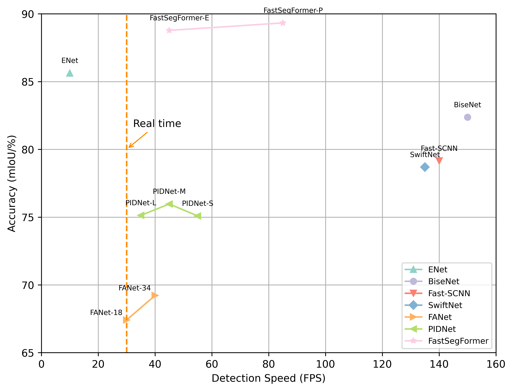
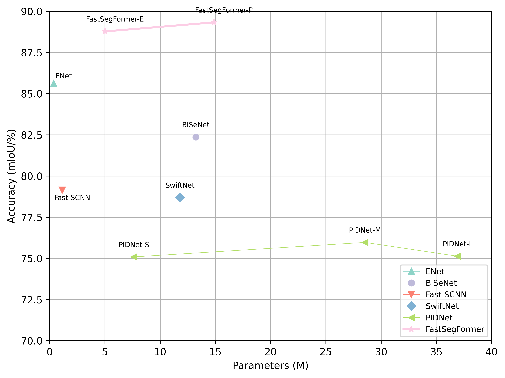
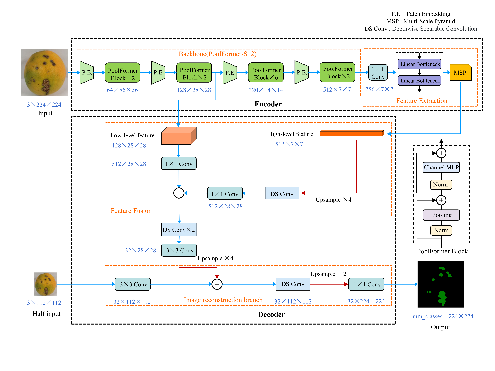

## FastSegFormer: A knowledge distillation-based method for real-time semantic segmentation of surface defects in navel oranges

This is the official repository for our work: FastSegFormer([PDF]())

### Highlights

Performance of different models on navel orange dataset (test set) against their inference speed.

Performance of different models on navel orange dataset (test set) against their parameters.

### Demos

A demo of the segmentation performance of our proposed FastSegFormer:Original image(left) and prediction of FastSegFormer-E(middle) and
FastSegFormer-P(right).

### Overview

* An overview of the architecture of our proposed FastSegFormer-P. The architecture of FastSegFormer-E is derived from FastSegFormer-P
replacing the backbone network EfficientFormerV2-S0.

* An overview of the proposed multi-resolution knowledge distillation.(To solve the problem that the size and number of channels of the teacher network and student
network feature maps are different:the teacher network's feature maps are down-sampled by bilinear interpolation, and the student network's feature maps
 are convolved point-by-point to increase the number of channels)

**P&KL loss**:

$$
L_{logits}(\text{S}) = \frac{1}{W_{s}\times H_{s}}(k_1t^2 \sum_{i \in R}\text{KL}(q_i^s, q_i^t) + (1 - k_1)\sum_{i \in R}\text{MSE}(p_i^s, p_i^t))
$$

Where $q_{i}^s$ represents the class probability of the $i$ th pixel output from the simple network S, $q_{i}^t$ represents
the class probability of the $i$ th pixel output from the complex network T, $\text{KL}(\cdot)$ represents Kullback-Leibler
divergence, $p_{i}^s$ represents the $i$ th pixel output from the simple network S, $p_{i}^t$ represents the $i$ th pixel
output from the complex network T, $\text{MSE}(\cdot)$ represents the mean square error calculation, 
$R=\{1,2,..., W_s\times H_s\}$ represents all pixels, and $t$ represents the temperature coefficient. In this experiment, 
$t=2$, $k_1=0.5$.

**NFD loss**:

$$
L_{n}^{NFD} = \sum_{i=1}^n \frac{1}{W_s\times H_s} L_2(\text{Normal}(F_{i}^t), \text{Normal}(F_{i}^s))
$$

Where $n$ represents the number of intermediate feature maps, $W_s$ and $H_s$ represent the height and width of the simple model 
feature map, $L_2(\cdot)$ represents the Euclidean calculation of the feature maps, $F_{i}^t$ represents the $i$ th feature map generated
by the complex network T, $F_{i}^s$ represents the $i$ th feature map generated by the simple network S,
$\text{Normal}$ represents the normalization of the feature maps on $(W, H)$, the $\text{Normal}(\cdot)$ is given as follows:

$$
\bar{F} = \frac{1}{\sigma}(F - u)
$$

where $F$ represents the original feature map, $\bar{F}$ represents the feature transform, and 
$u$ and $\sigma$ represent the mean and standard deviation of the features.

### Models

* Pretrained backbone network:

|   Dataset    |    Input size    | PoolFormer-S12 | EfficientFormerV2-S0 |
|:------------:|:----------------:|:--------------:|:--------------------:|
| ImageNet-1K  | $224\times 224$  |  [download]()  |     [download]()     |

* Teacher network:

|   Dataset    |      Model      |   Input size    | mIoU(%) | mPA(%) | params | GFLOPs |     ckpt     |
|:------------:|:---------------:|:---------------:|:-------:|:------:|:------:|:------:|:------------:|
| Orange navel | swin-T-Att-UNet | $512\times 512$ |  90.53  | 94.65  | 49.21M | 77.80  | [download]() |

* FastSegFormer after fine-tuning and knowledge distillation:

|      Model       |    Input size    | mIoU(%) | mPA(%) | params | GFLOPs | RTX3060(FPS) | RTX3050Ti(FPS) |     ckpt     |
|:----------------:|:----------------:|:-------:|:------:|:------:|:------:|:------------:|:--------------:|:------------:|
| FastSegFormer-E  | $224\times 224$  |  88.78  | 93.33  | 5.01M  |  0.80  |      61      |       -        | [download]() |
| FastSegFormer-P  | $224\times 224$  |  89.33  | 93.33  | 14.87M |  2.70  |     104      |       -        | [download]() |

### Ablation study

