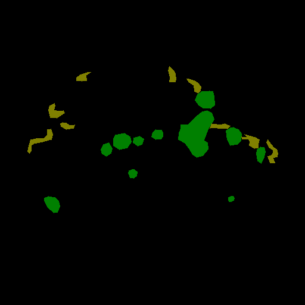
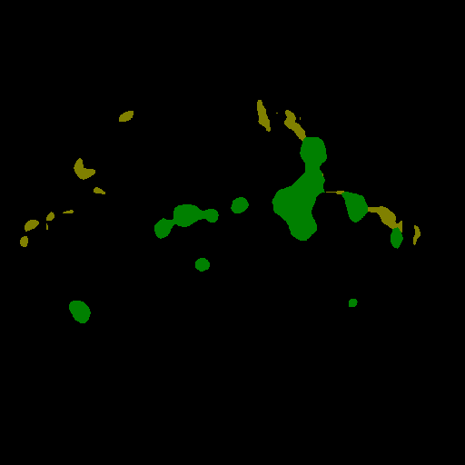
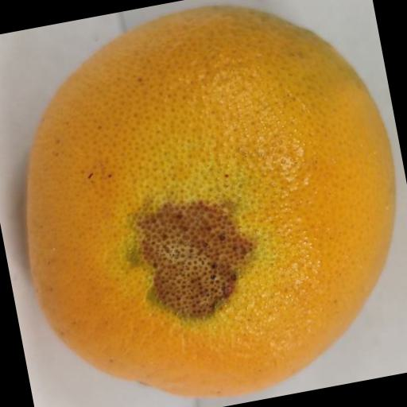
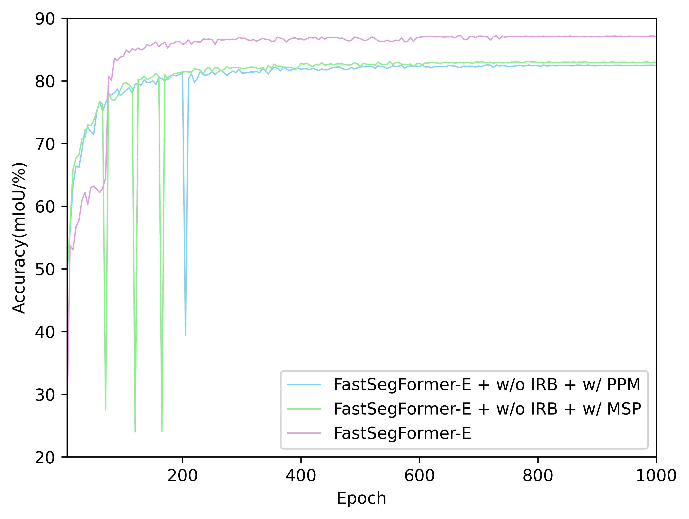

## FastSegFormer: A knowledge distillation-based method for real-time semantic segmentation of surface defects in navel oranges

[English](README.md)

这是我们工作的官方资料库: FastSegFormer([PDF](https://doi.org/10.1016/j.compag.2023.108604))

### 新闻

这项工作于2023年12月29日被`Computers and Electronics in Agriculture`期刊接收。

### 亮点

---

* 不同模型在脐橙数据集（测试集）上的表现与它们在RTX3060上的检测速度对比:

<p align="center">

</p>

* 不同模型在脐橙数据集（测试集）上的表现与它们的参数对比:

<p align="center">

</p>


### 更新

---

- [x] 完成训练和测试的代码。(2023 4.25)
- [x] 创建用于脐橙缺陷分割的PyQT接口。 (2023 5.10)
- [x] 制作30帧脐橙流水线模拟视频。 (2023 5.13)
- [x] 新增yolov8n-seg和yolov8s-seg实例分割训练，测试，预测的结果。[点击跳转](yolov8-seg/README_CH.md)(2023 12.10)

### 示例

---

* 我们提出的FastSegFormer的分割性能的一些演示：原始图像（左），标签图像（中）以及
FastSegFormer-P（右）。原始图像中包含增强的图像。

<!-- 3x6 grid of images -->
<div align="center">
  
  
  
  <br>
  
  
  
  <br>
  
  
  
</div>

* 脐橙视频分割的演示：原始视频（左）和检测视频（右）。通过半精度（FP16）量化技术和多线程技术，实际检测视频达到45~55帧(实际检测视频是图像的预处理、推理和后处理的总延迟）。
脐橙缺陷图片和视频检测用户界面可在[FastSegFormer-pyqt](https://github.com/caixiongjiang/FastSegFormer-pyqt)获得.

<p align="center">
  
  </br>
  <span align="center">Navel orange simulation line detection video</span>
</p>

### 概述

---

* 我们提出的FastSegFormer-P的架构概述。FastSegFormer-E的架构源自骨干网络Poolformer-S12取代EfficientFormerV2-S0。


* 提出的多分辨率知识提炼法的概述。（为了解决教师网络和学生网络特征图的大小和通道数不同的问题：教师网络的特征图通过双线性插值进行下采样，而学生网络的特征图通过逐点卷积来增加通道数。）


**P&KL loss**:

$$
L_{logits}(\text{S}) = \frac{1}{W_{s}\times H_{s}}(k_1t^2 \sum_{i \in R}\text{KL}(q_i^s, q_i^t) + (1 - k_1)\sum_{i \in R}\text{MSE}(p_i^s, p_i^t))
$$

其中 $q_{i}^s$ 从简单网络S输出的第 $i$ 类像素概率, $q_{i}^t$ 代表从复杂网络T输出的第 $i$ 类像素概率， $\text{KL}(\cdot)$ 代表Kullback-Leibler
divergence, $p_{i}^s$ 代表从简单网络S输出的第 $i$ 类像素, $p_{i}^t$ 代表从复杂网络T输出的第 $i$ 类像素, $\text{MSE}(\cdot)$ 代表均方误差的计算，
$R=\{1,2,..., W_s\times H_s\}$ 代表所有像素, and $t$ 代表温度系数. 在这个实验中， $t=2$, $k_1=0.5$.

**NFD loss**:

$$
L_{n}^{NFD} = \sum_{i=1}^n \frac{1}{W_s\times H_s} L_2(\text{Normal}(F_{i}^t), \text{Normal}(F_{i}^s))
$$

其中 $n$ 代表中间特征图的数量， $W_s$ 和 $H_s$ 代表简单模型特征图的高度和宽度, $L_2(\cdot)$ 代表特征图的欧几里得计算， $F_{i}^t$ 代表复杂网络T生成的第 $i$ 个特征图, 
$F_{i}^s$ 简单网络S生成的第 $i$ 个特征图，
$\text{Normal}$ 代表在特征图上进行$(W, H)$ 的归一化， $\text{Normal}(\cdot)$ 表示如下:

$$
\bar{F} = \frac{1}{\sigma}(F - u)
$$

其中 $F$ 代表原来的特征图, $\bar{F}$ 代表特征转换结果，并且
$u$ 和 $\sigma$ 代表特征图的均值和方差。

### 模型

---

* 预训练骨干网络:

|  Model(ImageNet-1K)  |    Input size    |                                                               ckpt                                                               |
|:--------------------:|:----------------:|:--------------------------------------------------------------------------------------------------------------------------------:|
| EfficientFormerV2-S0 | $224\times 224$  | [download](https://github.com/caixiongjiang/FastSegFormer/releases/download/v1.0.0/EfficientformerV2_s0_ImageNet_1k_224x224.pth) |
| EfficientFormerV2-S1 | $224\times 224$  | [download](https://github.com/caixiongjiang/FastSegFormer/releases/download/v1.0.0/EfficientformerV2_s1_ImageNet_1k_224x224.pth) |
|    PoolFormer-S12    | $224\times 224$  |    [download](https://github.com/caixiongjiang/FastSegFormer/releases/download/v1.0.0/poolformer_s12_ImageNet_1k_224x224.pth)    |
|    PoolFormer-S24    | $224\times 224$  |    [download](https://github.com/caixiongjiang/FastSegFormer/releases/download/v1.0.0/poolformer_s24_ImageNet_1k_224x224.pth)    |
|    PoolFormer-S36    | $224\times 224$  |    [download](https://github.com/caixiongjiang/FastSegFormer/releases/download/v1.0.0/poolformer_s36_ImageNet_1k_224x224.pth)    |
|       PIDNet-S       | $224\times 224$  |       [download](https://github.com/caixiongjiang/FastSegFormer/releases/download/v1.0.0/PIDNet_S_ImageNet_1k_224x224.pth)       |
|       PIDNet-M       | $224\times 224$  |       [download](https://github.com/caixiongjiang/FastSegFormer/releases/download/v1.0.0/PIDNet_M_ImageNet_1k_224x224.pth)       |
|       PIDNet-L       | $224\times 224$  |       [download](https://github.com/caixiongjiang/FastSegFormer/releases/download/v1.0.0/PIDNet_L_ImageNet_1k_224x224.pth)       |

* 教师网络:

|      Model      |   Input size    | mIoU(%) | mPA(%) | Params | GFLOPs |                                                                      ckpt                                                                       |
|:---------------:|:---------------:|:-------:|:------:|:------:|:------:|:-----------------------------------------------------------------------------------------------------------------------------------------------:|
| Swin-T-Att-UNet | $512\times 512$ |  90.53  | 94.65  | 49.21M | 77.80  | [download](https://github.com/caixiongjiang/FastSegFormer/releases/download/v1.0.0/teacher_Swin_T_Att_Unet_Orange_Navel_4.5k_input_512x512.pth) |

* 微调和知识蒸馏后的FastSegFormer模型:

|      Model       |    Input size    | mIoU(%) | mPA(%) | Params | GFLOPs | RTX3060(FPS) | RTX3050Ti(FPS) |                                                               ckpt                                                                |                                                   onnx                                                   |
|:----------------:|:----------------:|:-------:|:------:|:------:|:------:|:------------:|:--------------:|:---------------------------------------------------------------------------------------------------------------------------------:|:--------------------------------------------------------------------------------------------------------:|
| FastSegFormer-E  | $224\times 224$  |  88.78  | 93.33  | 5.01M  |  0.80  |      61      |       54       | [download](https://github.com/caixiongjiang/FastSegFormer/releases/download/v1.0.1/FastSegFormer_E_Orange_Navel_4.5k_224x224.pth) | [download](https://github.com/caixiongjiang/FastSegFormer/releases/download/v1.0.2/FastSegFormer_E.onnx) |
| FastSegFormer-P  | $224\times 224$  |  89.33  | 93.78  | 14.87M |  2.70  |     108      |       93       | [download](https://github.com/caixiongjiang/FastSegFormer/releases/download/v1.0.1/FastSegFormer_P_Orange_Navel_4.5k_224x224.pth) | [download](https://github.com/caixiongjiang/FastSegFormer/releases/download/v1.0.2/FastSegFormer_P.onnx) |


### 消融研究

---

你可以在`logs`文件夹中看到我们实验的所有结果和过程，其中包括消融研究和与其他轻量级模型的比较。

* 具有不同网络结构（PPM、MSP和图像重建分支）的FastSegFormer模型在验证集上的准确率(mIoU):

<p align="left">


</p>

* Knowledge distillation(KD) and fine-tuning(†):

|               Model                | mIoU(%) | mPA(%) | mPrecision(%) | Params | GFLOPs |
|:----------------------------------:|:-------:|:------:|:-------------:|:------:|:------:|
|          FastSegFormer-E           |  86.51  | 91.63  |     93.50     |  5.01  |  0.80  |
|  FastSegFormer-E w/ $\text{KD}_1$  |  87.24  | 92.20  |     93.82     |  5.01  |  0.80  |
|  FastSegFormer-E w/ $\text{KD}_2$  |  87.38  | 92.35  |     93.83     |  5.01  |  0.80  |
|          FastSegFormer-E†          |  88.49  | 93.16  |     94.32     |  5.01  |  0.80  |
| FastSegFormer-E w/ $\text{KD}_1$ † |  88.68  | 92.97  |     94.75     |  5.01  |  0.80  |
| FastSegFormer-E w/ $\text{KD}_2$ † |  88.78  | 93.33  |     94.48     |  5.01  |  0.80  |
|          FastSegFormer-P           |  84.15  | 89.44  |     92.84     | 14.87  |  2.70  |
|  FastSegFormer-P w/ $\text{KD}_1$  |  84.77  | 90.12  |     92.91     | 14.87  |  2.70  |
|  FastSegFormer-P w/ $\text{KD}_2$  |  85.43  | 90.64  |     93.20     | 14.87  |  2.70  |
|          FastSegFormer-P†          |  88.57  | 93.15  |     94.42     | 14.87  |  2.70  |
| FastSegFormer-P w/ $\text{KD}_1$ † |  88.94  | 93.25  |     94.77     | 14.87  |  2.70  |
| FastSegFormer-P w/ $\text{KD}_2$ † |  89.33  | 93.78  |     94.68     | 14.87  |  2.70  |

### 环境

---

这个实现基于[unet-pytorch](https://github.com/bubbliiiing/unet-pytorch)。检测速度指标(FPS)是在单个RTX3060和单个RTX3050Ti上测试。

* 硬件配置： 一个拥有12G显存的显卡是必须的，因为我们的知识蒸馏方法在训练中会占用大量的显存。(当知识蒸馏的批量大小为6时，显存占用11.8G)、
 当然，你也可以跳过蒸馏方法，这将占用非常少的显存。
* 基本环境配置： 我们的代码目前只支持单卡训练。我们的训练环境:Python 3.9, Pytorch 1.12.1, CUDA 11.6.

### 使用

#### 准备数据集

我们只提供了带有1448张VOC格式的脐橙缺陷图像的数据集，如果你想扩展数据集，可以使用
[Imgaug for segmentation maps and masks](https://imgaug.readthedocs.io/en/latest/source/examples_segmentation_maps.html)进行图像增强。

* 下载[Orange_Navel_1.5k](https://github.com/caixiongjiang/FastSegFormer/releases/download/v1.0.0/Orange_Navel_1.5k.zip)数据集并解压在`data/Orange_Navel_1.5k`目录下.
* 我们提供的数据集已经按照训练验证测试6:2:2进行了随机划分。可以使用`voc_annotation.py`重新随机化或在改变比例后重新随机化。

#### 训练

* 下载源代码压缩包或克隆该项目:
```shell
$ git clone https://github.com/caixiongjiang/FastSegFormer
```
* 进入项目的根目录，激活虚拟环境，下载所需的软件包:
```shell
$ conda activate 'your anaconda environment'
$ pip install -r requirements.txt
```

* 下载ImageNet预训练的模型，并将其放入`model_data`目录。

感谢三个资源库[EfficientFormer](https://github.com/snap-research/EfficientFormer)，
[poolformer](https://github.com/sail-sg/poolformer)和[PIDNet](https://github.com/XuJiacong/PIDNet)，我们提供了EfficientFormerV2、PoolFormer和PIDNet在ImageNet-1K上的预训练权重。
* 修改以下的参数`train.py`。例如，训练FastSegFormer-P(fin-tuning):
```python
backbone    = "poolformer_s12"
pretrained  = False
model_path  = "model_data/poolformer_s12.pth"
input_shape = [224, 224]
```
* 在Orange_Navel_1.5k上训练FastSegFormer-P模型，批次大小为32。
```shell
python train.py
```

#### 知识蒸馏（KD）训练

你可以用KD或KD+微调进行训练。

* 例如，用KD+微调进行训练，下载ImageNet预训练模型的权重和
下载教师网络的权重（Swin-T-Att-UNet）。然后把它们放到`model_data`目录下。

* 修改`train_distillation.py`的参数。例如，训练FastSegFormer-P(KD + fine-tuning):
```python
t_backbone = "swin_T_224"
s_backbone = "poolformer_s12"
pretrained = False
t_model_path = "model_data/teacher_Swin_T_Att_Unet_input_512.pth"
s_model_path = "model_data/poolformer_s12.pth" # if s_model_path = "": from scratch else fine-tuning

Init_Epoch = 0
Freeze_Epoch = 50
Freeze_batch_size = 6
UnFreeze_Epoch = 1000
Unfreeze_batch_size = 6
Freeze_Train = True

Init_lr = 1e-5
Min_lr = Init_lr * 0.01
```

* 在`Orange_Navel_1.5k`数据上使用微调和KD训练FastSegFormer-P模型，批次大小为6。
```shell
python train_distillation.py
```


#### 对分割的评估
* 例如，下载`Orange_Navel_1.5k`的微调模型FastSegFormer-P并将其放入`logs/FastSegFormer-P`目录下。
* 修改`unet.py`的参数。例如，评估FastSegFormer-P(fin-tuning):
```python
_defaults = {
        "model_path"    : 'logs/FastSegFormer-P.pth',
        "num_classes"   : 3 + 1,
        "backbone"      : "poolformer_s12",
        "input_shape"   : [224, 224],
        "mix_type"      : 1,
        "cuda"          : True,  # if backbone = efficientFormerV2, cuda should be False
    }

def generate(self, onnx=False):
    self.net = FastSegFormer(num_classes=self.num_classes, pretrained=False, backbone=self.backbone, Pyramid="multiscale", cnn_branch=True)
```
* 在`Navel_Orange_1.5k`上评估测试集，结果将在`miou_out`目录下。
```shell
python get_miou.py
```

#### 预测
与评估环节相同，首先修改`unet.py`的参数，然后运行`predict.py`:
```shell
python predict.py
# 生成提升并输入图片地址
Input image filename:'your image dir'
```

#### 部署评估
* 检测速度(FPS):
```shell
python speeding.py
```

* Parameters 和 GFLOPs:
```shell
python model_flop_params.py
```

### 引用

---

如果你的这个实现对你的工作有帮助，请引用我们的论文:
```bib
@article{cai2024fastsegformer,
  title={FastSegFormer: A knowledge distillation-based method for real-time semantic segmentation of surface defects in navel oranges},
  author={Cai, Xiongjiang and Zhu, Yun and Liu, Shuwen and Yu, Zhiyue and Xu, Youyun},
  journal={Computers and Electronics in Agriculture},
  volume={217},
  pages={108604},
  year={2024},
  publisher={Elsevier}
}
```

### 致谢

---

* 这个实现基于[unet-pytorch](https://github.com/bubbliiiing/unet-pytorch).
* FPS测量代码借鉴[FANet](https://github.com/feinanshan/FANet)的做法。
* 骨干网络预训练权重从以下地方下载，[EfficientFormer](https://github.com/snap-research/EfficientFormer), 
[poolformer](https://github.com/sail-sg/poolformer) and [PIDNet](https://github.com/XuJiacong/PIDNet).
